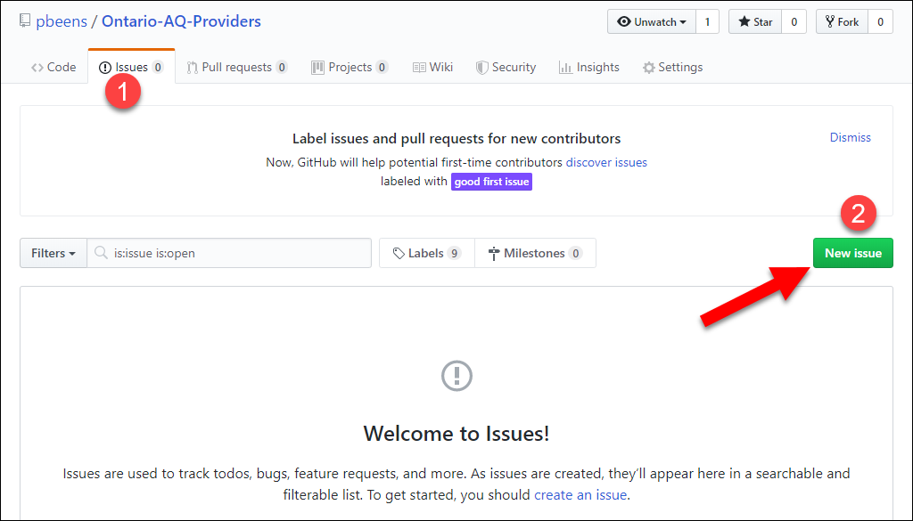

# AQ Providers in Ontario, Canada

Welcome to this "communal" list of AQ providers in Ontario. I have created this as a resource for teachers that can be edited and maintained by anyone.

This first version has been created to solicit feedback on the fields I'll be using for each AQ Provider. Please see the [Template](#template) section and let me know if you have any recommended changes before I start entering the other providers. You can either [email me](mailto:pbeens@gmail.com) with your proposed changes or use the Issues tab above.

If you missed the initial announcement about this page on my blog, visit [here](https://www.beens.ca/?p=208).

## Contents

  * [Brock](#brock)
  * [ETFO](#etfo)
  * [Lakehead University](#lakehead-university)
  * [Laurentian University](#laurentian-university)
  * [Niagara University](#niagara-university)
  * [OECTA](#oecta)
  * [OISE - University of Toronto](#oise---university-of-toronto)
  * [Queen's University](#queens-university)
  * [Western](#western)
  * [York University](#york-university)
  * [Template](#template)

<small><i><a href='http://ecotrust-canada.github.io/markdown-toc/'>Table of contents generated with markdown-toc</a></i></small>

## Brock

* URL: [https://brocku.ca/guides-and-timetables/registration/in-service/](https://brocku.ca/guides-and-timetables/registration/in-service/)
* Important Dates: <https://brocku.ca/guides-and-timetables/dates/>
* Contact Info:
  * URL: <https://brocku.ca/guides-and-timetables/registration/in-service/>
  * Contact Name: N/A
  * Phone: 905-688-5550 x3099
  * Email: [records@brocku.ca](mailto:records@brocku.ca)
  * Fax: N/A
  * Address: [1812 Sir Isaac Brock Way, St. Catharines, ON L2S 3A1](https://goo.gl/maps/DsScdbsu3Yhqv4d59)
* Fee: All AQ courses	$685 ([source](https://brocku.ca/safa/tuition-and-fees/overview/inservice/))
* FAQs: N/A

## ETFO

* URL: [https://etfo-aq.ca/](https://etfo-aq.ca/)
* Important Dates: [https://etfo-aq.ca/catalogue/#dates](https://etfo-aq.ca/catalogue/#dates)
* Contact Info:
  * URL: [https://etfo-aq.ca/contact/](https://etfo-aq.ca/contact/)
  * Contact Name: N/A
  * Phone: (416) 355-6752, 1-888-838-3836 x 3803
  * Email: [aqcourses@etfo.org](mailto:aqcourses@etfo.org)
  * Fax: (416) 355-6753, 1-877-832-0761
  * Address: [136 Isabella St, Toronto, ON M4Y 0B5](https://goo.gl/maps/yJhnAiyzakkzT6XU7)
* Fee: The course fee for all ETFO AQs is $650 per course. $50 of this is a non-refundable registration fee. The $650 course fee is tax deductible. ([source](https://etfo-aq.ca/faqs/))
* FAQs: [https://etfo-aq.ca/faqs/](https://etfo-aq.ca/faqs/)

## Lakehead University

* URL: [https://www.lakeheadu.ca/programs/departments/education/pd/about-aq-courses](https://www.lakeheadu.ca/programs/departments/education/pd/about-aq-courses)
* Important Dates: Look for "Additional Qualification Course Schedule" [here].(https://www.lakeheadu.ca/programs/departments/education/pd).
* Contact Info:
  * URL: https://www.lakeheadu.ca/programs/departments/education/pd/about-aq-courses
  * Contact Name: Colleen Woods
  * Phone: (807) 343-8178
  * Email: [AQYourWay@LakeheadU.ca](mailto:AQYourWay@LakeheadU.ca)
  * Fax: : (807) 346-7882
  * Address: [955 Oliver Rd, Thunder Bay, ON P7B 5E1](https://goo.gl/maps/JdEF1sAQF6xTUnDB8)
* Fee: $650 for AQs and $725 for ABQs and Honour Specialist
* FAQs: N/A

## Laurentian University

* URL: [https://laurentian.ca/aq-and-abq-courses](https://laurentian.ca/aq-and-abq-courses)
* Important Dates: [https://laurentian.ca/aq-and-abq-courses](https://laurentian.ca/aq-and-abq-courses)
* Contact Info:
  * URL: [https://laurentian.ca/aq-and-abq-courses](https://laurentian.ca/aq-and-abq-courses)
  * Contact Name: (See webpage)
  * Phone: (800) 461-4030
  * Email: [AQ-courses@laurentienne.ca](mailto:AQ-courses@laurentienne.ca)
  * Fax: N/A
  * Address: [935 Ramsey Lake Rd. Sudbury, ON P3E 2C6](https://goo.gl/maps/mid4MPkRutLjtjpy8)
* Fee: AQ $675, ABQ $750
* FAQs: N/A

## Niagara University

* URL: [http://www.niagara.edu/aq](http://www.niagara.edu/aq)
* Important Dates: [https://www.niagara.edu/aq-schedule/](https://www.niagara.edu/aq-schedule/)
* Contact Info:
  * URL: [https://www.niagara.edu/aq-contact/](https://www.niagara.edu/aq-contact/)
  * Contact Name: Carmela Vitale
  * Phone: 905.294.7260 ext. 1104
  * Email: [http://apps.niagara.edu/people/contact.php?pid=0044052](http://apps.niagara.edu/people/contact.php?pid=0044052)
  * Fax: N/A
  * Address: [2904 Hwy 7 #113, Vaughan, ON L4K 0K4](https://goo.gl/maps/5yVLQtNfMFASfPCA8)
* Fee: AQ courses: $695, ABQ courses: $650 (CAD); for graduates of Niagara the fee is AQ: $625, ABQ: $585 (CAD)
* FAQs: N/A

## OECTA

* URL: <http://www.catholicteachers.ca/For-Your-Career/AQ-Courses>
* Important Dates: Deadlines can be found on the course registration page.
* Contact Info:
  * URL: <http://www.catholicteachers.ca/Contact-Us>
  * Contact Name: N/A
  * Phone: 416-925-2493 or toll free 1-800-268-7230
  * Email: [registrar@catholicteachers.ca](mailto:registrar@catholicteachers.ca)
  * Fax: 416-925-7764
  * Address: [65 St Clair Av E, Toronto, ON M4T 2Y3](https://goo.gl/maps/Vd44ysYowUU9D59v7)
* Fee: The OECTA AQ course fee is $600 except for Religious Education Part I which is $550.  
<http://www.catholicteachers.ca/For-Your-Career/AQ-Courses/Course-Fees-and-Cancellation>
* FAQs: <http://www.catholicteachers.ca/For-Your-Career/AQ-Courses/FAQs>

## OISE - University of Toronto

* URL: [https://cpl.oise.utoronto.ca/program_area/additional-qualitfications/](https://cpl.oise.utoronto.ca/program_area/additional-qualitfications/)
* Important Dates: N/A
* Contact Info:
  * URL: N/A
  * Contact Name: N/A
  * Phone: (416) 978-2474
  * Email: [oise.cpl@utoronto.ca](mailto:oise.cpl@utoronto.ca)
  * Fax: N/A
  * Address: [252 Bloor St W, Toronto, ON M5S 1V6](https://goo.gl/maps/wRv9JnE4RTUA29ot5)
* Fee: 
AQ Course Fee $685.00, ABQ Course Fee $735.00, Honour Specialist $TBD
* FAQs: N/A

## Queen's University

* URL: [https://coursesforteachers.ca/courses](https://coursesforteachers.ca/courses)
* Important Dates: [https://coursesforteachers.ca/courses](https://coursesforteachers.ca/courses)
* Contact Info:
  * URL: https://coursesforteachers.ca/on/contact
  * Contact Name: N/A
  * Phone: (613) 533-2387
  * Email: [cedmail@queensu.ca](mailto:cedmail@queensu.ca)
  * Fax: (613) 533-6702
  * Address: [Duncan McArthur Hall, 511 Union St W, Kingston, ON K7M 2H3](https://goo.gl/maps/LuSXnrYGw4YwWw7D9)
* Fee: ABQ/AQ: $685-$745 (see website), Honour Specialist: $745
* FAQs: N/A

## Western

* URL: [https://www.aspire.uwo.ca/additionalQualifications.html](https://www.aspire.uwo.ca/additionalQualifications.html)
* Important Dates: https://www.aspire.uwo.ca/dates.html
* Contact Info:
  * URL: https://www.aspire.uwo.ca/contact.html
  * Contact Name: N/A
  * Phone: 519.661.2111 ext. 84976
  * Email: [aspire@uwo.ca](mailto:aspire@uwo.ca)
  * Fax: 519.850.2526
  * Address: [1137 Western Rd, London, ON N6G 1G7](https://goo.gl/maps/CQ62hS4QwThdmmi39)
* Fee: Three-Part AQ: $675, Additional Basic AQ: $675, Honour Specialist: $725, Tech Studies: $725
* FAQs: N/A

## York University

* URL: [https://edu.yorku.ca/profdev/](https://edu.yorku.ca/profdev/)
* Important Dates: [http://edu.yorku.ca/profdev/forms-fees-dates/](http://edu.yorku.ca/profdev/forms-fees-dates/)
* Contact Info:
  * URL: [http://site.info.yorku.ca/](http://site.info.yorku.ca/)
  * Contact Name: N/A
  * Phone: (416) 736-2100
  * Email: N/A
  * Fax: (416) 736-5023
  * Address: [4700 Keele St, Toronto, ON M3J 1P3](https://goo.gl/maps/yiFxrgj4x3iX2QT18)
* Fee: AQ Course Tuition: $685, ABQ Course Tuition: $735, Honour Specialist: $750
* FAQs: N/A

## Template

* URL: 
* Important Dates: 
* Contact Info:
  * URL: 
  * Contact Name: 
  * Phone: 
  * Email: 
  * Fax: 
  * Address: (w/ link to Google Maps)
* Fee: 
* FAQs: 
